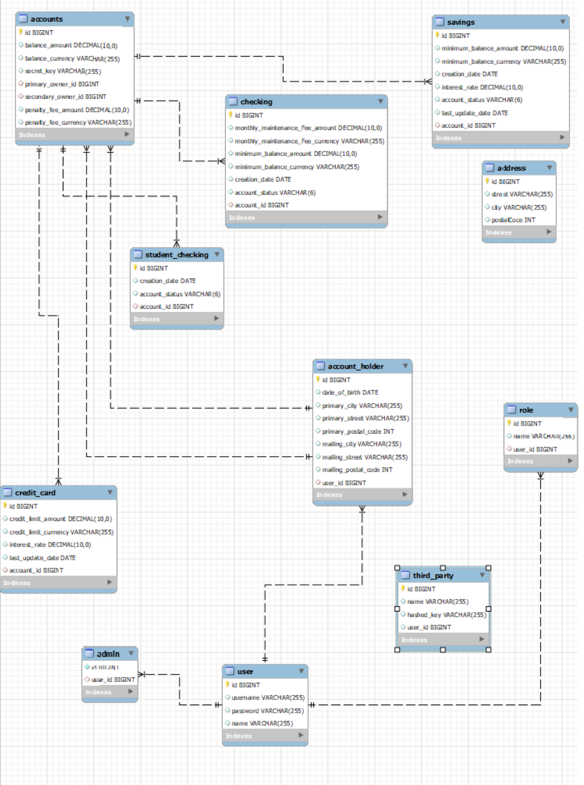

# midterm-mariamoyano
<h1> Midterm project: Building a banking system </h1>

1. The system have 4 types of accounts: StudentChecking, Checking, Savings, and CreditCard.
2. The system have 3 types of Users: 
* Admins 
* AccountHolders.
* ThirdParty(out of system)
3. Admins can create new accounts. When creating a new account they can create Checking, Savings, or CreditCard Accounts.
4. Interest and Fees should be applied appropriately
5. Account Access 

<h2>CLASS DIAGRAM</h2>

<h2>MYSQL</h2>
* See -> midterm.mysql
<h3> Admins </h3>
* Admins should be able to access the balance for any account and to modify it.
<h3> AccountHolders </h3>
* AccountHolders should be able to access their own account balance
* Account holders should be able to transfer money from any of their accounts to any other account (regardless of owner). The transfer should only be processed if the account has sufficient funds. The user must provide the Primary or Secondary owner name and the id of the account that should receive the transfer.
<h3> Third-Party Users </h3>
* There must be a way for third-party users to receive and send money to other accounts.
* Third-party users must be added to the database by an admin.
* In order to receive and send money, Third-Party Users must provide their hashed key in the header of the HTTP request. They also must provide the amount, the Account id and the account secret key.
<h2> Technical Requirements </h2>
* Include a Java/Spring Boot backend.
* Everything should be stored in MySQL database tables.
* Include at least 1 GET, POST, PUT/PATCH, and DELETE route.
* Include authentication with Spring Security.
* Include unit and integration tests.
* Include robust error handling.
* You must use the Money class for all currency and BigDecimal for any other decimal or large number math.
<h2> Deliverables </h2>
* A working REST API, built by you that runs on a local server.
* The URL of the GitHub repository for your app.
* A simplified class diagram representing your project structure should be added to the repo.
* Adequate and complete documentation in the README.md file.

